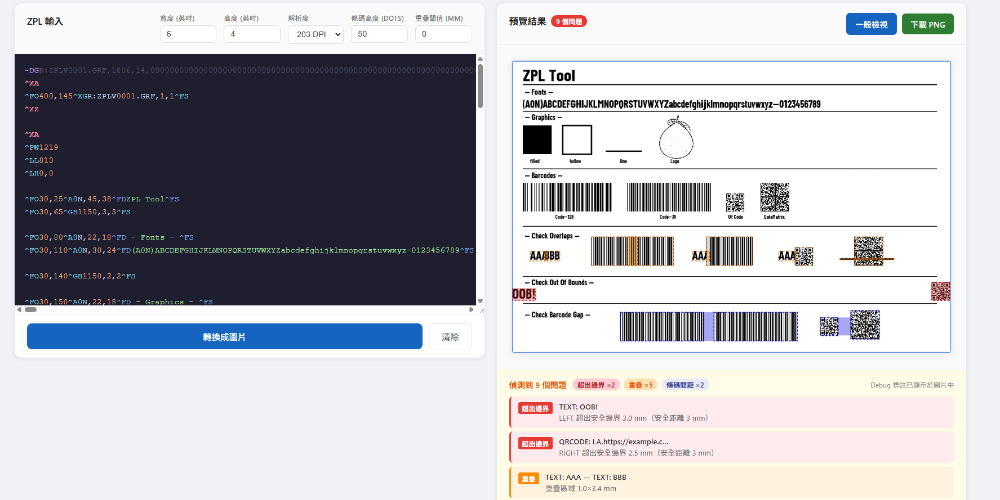

# ZPL Tool

ZPL ↔ PNG 雙向轉換工具，完全本地運行，不依賴任何雲端 API。

- **Frontend**：Angular 15（standalone components）
- **Backend**：Spring Boot 3.2 + Java 17
- **ZPL 渲染**：Java AWT（文字／圖形）+ [ZXing](https://github.com/zxing/zxing)（條碼）
- **OCR**：[Tess4J 5.8](https://github.com/nguyenq/tess4j)（Tesseract 5，選用）

---

## 功能

### Tab 1 — ZPL → PNG

| 功能 | 說明 |
|------|------|
| ZPL 渲染 | 支援常用 ZPL II 指令，即時預覽 PNG |
| 字型精準度 | Cap-height 基準線對齊、Font 0 寬度比例修正（×0.82）、四方向旋轉 |
| 多種條碼 | Code 128（`^BC`，預設 Code128-B）、Code 39（`^B3`）、QR Code（`^BQ`） |
| 精確條碼寬度 | 兩步驟編碼：先算模組數再乘以 `barcodeModuleWidth`，確保條寬完全正確 |
| 點陣圖形 | `~DG`（存入印表機 RAM）+ `^XG`（呼叫回放） |
| 反轉欄位 | `^FR`：以 XOR 模式繪製，黑底白字／白底黑字正確互換（用於巢狀圖形） |
| 標籤設定 | 可調整寬度、高度（英吋）與解析度（203 / 300 / 600 DPI） |
| 問題偵測 | 自動偵測欄位**超出邊界**與**重疊**，附詳細說明 |
| Debug 模式 | 一鍵切換：在圖片上標示問題區域（紅色＝超出、橘色＝重疊） |
| 可調閾值 | 重疊判定閾值（dots）可自由設定，避免誤報 |
| 下載 PNG | 支援下載一般圖片或 Debug 標註圖片 |

### Tab 2 — PNG → ZPL

| 功能 | 說明 |
|------|------|
| 條碼偵測 | ZXing 解碼 → `^BC` / `^B3` / `^BQ` |
| 形狀偵測 | Connected Components + 矩形分類 → `^GB`（實心、空心、線條） |
| 文字 OCR | Tess4J（需自備 tessdata）→ `^A0^FD` |
| 殘留保真 | 未辨識像素編碼為 `~DG` hex + `^XG` 還原，確保不失真 |
| 偵測預覽 | 彩色標注圖：青色＝條碼、綠色＝形狀、橘色＝文字 |
| 一鍵送出 | 「送至 ZPL 預覽器」按鈕直接切換 Tab 並填入生成的 ZPL |

---

## 實測截圖

> Debug 模式下同時偵測到**重疊**（橘色）與**超出邊界**（紅色），並在圖片上標示位置。



---

## 專案結構

```
ZPLViewer/
├── backend/                          # Spring Boot
│   └── src/main/java/com/zplviewer/
│       ├── ZplViewerApplication.java
│       ├── config/WebConfig.java     # CORS 設定
│       ├── controller/
│       │   ├── ZplController.java    # POST /api/zpl/convert
│       │   └── PngController.java    # POST /api/png/to-zpl
│       ├── model/
│       │   ├── ZplRequest.java
│       │   ├── ConvertResponse.java
│       │   ├── RenderWarning.java
│       │   ├── PngToZplRequest.java  # image / threshold / minShapeDots / tessDataPath
│       │   └── PngToZplResponse.java # zpl / previewImage
│       └── service/
│           ├── ZplService.java       # 協調渲染流程
│           ├── ZplRenderer.java      # 核心渲染器（含 ~DG / ^XG / ^FR）
│           └── PngToZplService.java  # PNG→ZPL 分析引擎
└── frontend/                         # Angular 15
    └── src/app/
        ├── app.component.ts          # 雙頁籤元件邏輯
        ├── app.component.html
        └── app.component.css
```

---

## 快速開始

### 需求

| 工具 | 版本 |
|------|------|
| Java | 17+ |
| Maven | 3.8+ |
| Node.js | 18+ |
| Angular CLI | 15+ |

### 啟動後端

```bash
cd backend
mvn spring-boot:run
```

服務啟動於 `http://localhost:8080`

### 啟動前端

```bash
cd frontend
npm install
npm start
```

開啟瀏覽器前往 `http://localhost:4200`

---

## OCR 設定（選用）

文字偵測（PNG → ZPL）需要 Tesseract 語言資料：

1. 下載 [`eng.traineddata`](https://github.com/tesseract-ocr/tessdata/raw/main/eng.traineddata)
2. 放置於本機目錄，例如 `C:\tessdata\`
3. 在「PNG → ZPL」頁籤的「tessdata 路徑」欄位填入該路徑

> 若不填寫，OCR 步驟會被略過，文字區塊改由殘留 `~DG` 保留。

---

## API

### `POST /api/zpl/convert` — ZPL → PNG

**Request body（JSON）：**

```json
{
  "zpl": "^XA^FO50,50^A0N,50,50^FDHello World^FS^XZ",
  "width": 4,
  "height": 6,
  "dpmm": 8,
  "debug": false,
  "overlapThresholdDots": 5
}
```

| 欄位 | 型別 | 預設 | 說明 |
|------|------|------|------|
| `zpl` | string | — | ZPL 代碼內容 |
| `width` | double | 4.0 | 標籤寬度（英吋） |
| `height` | double | 6.0 | 標籤高度（英吋） |
| `dpmm` | int | 8 | 解析度（8＝203 DPI，12＝300 DPI，24＝600 DPI） |
| `debug` | boolean | false | `true` 時回傳的圖片會疊加問題標註 |
| `overlapThresholdDots` | int | 5 | 重疊閾值（dots）；交集的寬與高同時超過此值才視為重疊 |

**Response body（JSON）：**

```json
{
  "image": "<Base64 PNG>",
  "warnings": [
    {
      "type": "OUT_OF_BOUNDS",
      "fieldA": "CODE128: 123456789",
      "detail": "RIGHT 超出 23 dots",
      "sides": "RIGHT",
      "excessDots": 23,
      "boundsA": [50, 200, 835, 100]
    },
    {
      "type": "OVERLAP",
      "fieldA": "TEXT: Hello World",
      "fieldB": "CODE128: 123456789",
      "detail": "重疊區域 200×30 dots",
      "boundsA": [50, 50, 300, 60],
      "boundsB": [50, 100, 835, 100],
      "intersect": [50, 100, 300, 30]
    }
  ]
}
```

### `POST /api/png/to-zpl` — PNG → ZPL

**Request body（JSON）：**

```json
{
  "image": "<Base64 PNG 或 data URI>",
  "threshold": 128,
  "minShapeDots": 20,
  "tessDataPath": "C:/tessdata"
}
```

| 欄位 | 型別 | 預設 | 說明 |
|------|------|------|------|
| `image` | string | — | Base64 編碼的 PNG（可含 `data:image/png;base64,` 前綴） |
| `threshold` | int | 128 | 灰階二值化閾值（0–255），低於此值視為黑色 |
| `minShapeDots` | int | 20 | 形狀偵測最小面積（px），過濾雜訊 |
| `tessDataPath` | string | `C:/tessdata` | Tesseract 語言資料目錄，留空則跳過 OCR |

**Response body（JSON）：**

```json
{
  "zpl": "~DGR:ZPLV0001.GRF,...\n^XA\n...\n^XZ\n",
  "previewImage": "<Base64 PNG 偵測標注圖>"
}
```

---

## 支援的 ZPL 指令

| 指令 | 說明 |
|------|------|
| `^XA` / `^XZ` | 標籤開始／結束 |
| `^FO{x},{y}` | 欄位原點（Field Origin，絕對座標） |
| `^FT{x},{y}` | 欄位原點（Field Top，同 ^FO） |
| `^FR` | 欄位反轉（Field Reverse）：以 XOR 模式繪製，正確實作巢狀圖形反色 |
| `^A0{o},{h},{w}` | CG Triumvirate 可縮放字型（N／R／I／B 四種方向） |
| `^AA`–`^AZ` | 點陣字型 A–Z（等寬，四種方向） |
| `^CF{font},{h}` | 變更預設字型與高度 |
| `^FD...^FS` | 欄位資料 |
| `^BY{mw},,{h}` | 條碼預設值（模組寬、高） |
| `^BC{o},{h},{text}` | Code 128 條碼（預設 Code128-B，符合 ZPL 規格） |
| `^B3{o},{h},{text}` | Code 39 條碼 |
| `^BQ{o},{model},{mag}` | QR Code |
| `^GB{w},{h},{thick},{color},{round}` | 圖形方框／線條（含圓角） |
| `~DG{name},{total},{bpr},{hex}` | 將點陣圖形存入印表機 RAM |
| `^XG{name},{mx},{my}` | 呼叫已存入的點陣圖形 |
| `^LH` / `^PW` / `^LL` | 標籤位置／寬度／長度（解析但不重設畫布） |

---

## 渲染精準度說明

### 字型高度與基準線

ZPL `^A0N,{h}` 中的 `h` 代表大寫字母（Cap Height），而非 Java em-size。渲染器以 GlyphVector 直接測量 `'H'` 的視覺高度（`capHpx`），並以 `baseline = fieldOriginY + capHpx` 定位，使大寫字母頂端精確對齊 `fieldOriginY`。

### Font 0 寬度修正

Java `SANS_SERIF Bold`（Arial）比 ZPL Font 0（CG Triumvirate Bold）寬約 20%。未明確指定 `^A0` 寬度時，渲染器套用 `xScale = 0.82` 修正。

### 條碼模組寬度

ZXing 的 `width` 參數為目標像素寬，實際條寬會因模組數取整而偏差。渲染器採**兩步驟**策略：

1. 以 `width=1` 編碼，取得精確模組數（`matrix.getWidth()`）
2. 以 `moduleCount × barcodeModuleWidth` 重新編碼，確保每個條模組寬度恰好等於 `barcodeModuleWidth`

### `^FR` XOR 語義

ZPL `^FR` 使用 XOR 繪製：黑底上的黑色矩形→白色，白底上的黑色矩形→黑色。渲染器對應使用 `g.setXORMode(Color.WHITE)` + `g.setPaintMode()`，正確還原巢狀方框（如公司 Logo）的框線效果。

---

## 問題偵測機制

渲染完成後，`ZplRenderer.analyze()` 對所有欄位的 BoundingBox 做兩項檢查：

### 超出邊界（OUT_OF_BOUNDS）

任一欄位的邊界超出標籤範圍即觸發，並標示超出的邊（LEFT／TOP／RIGHT／BOTTOM）及超出 dots 數。

### 重疊（OVERLAP）

對所有欄位兩兩比對交集矩形。當交集的**寬度 AND 高度**同時超過 `overlapThresholdDots` 時才觸發警告，避免因浮點誤差或刻意設計（如邊框）產生誤報。

### Debug Overlay 顏色說明

| 顏色 | 意義 |
|------|------|
| 藍色實線 | 標籤邊界 |
| 紅色虛線框 ＋ 半透明紅填色 | 超出邊界的欄位（取可見部分） |
| 橘色虛線框 ＋ 半透明橘填色 | 重疊的欄位對及其交集區 |

---

## 開發注意事項

- 後端 CORS 預設僅允許 `http://localhost:4200`，如需修改請編輯 `WebConfig.java`
- 標籤尺寸換算：`dots = 英吋 × 25.4 × dpmm`（例如 4" × 8dpmm = 812 dots）
- `ZplRenderer` 每次請求建立新實例，非 singleton，天然執行緒安全
- 渲染流程：`render()` → `analyze()` → `applyDebugOverlay()`（選用）→ `toPng()`
